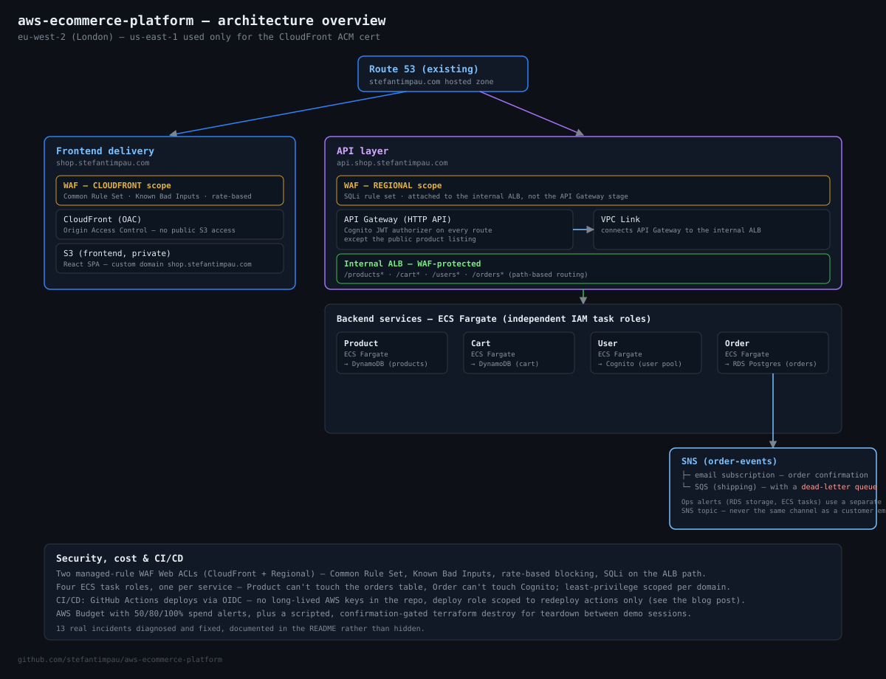

# aws-ecommerce-platform

Flagship project in an AWS portfolio series (follows [`aws-enterprise-network`](../aws-enterprise-network)). A full-stack, containerized e-commerce reference build on AWS — Cognito auth, a React frontend on S3/CloudFront, four ECS Fargate microservices behind an internal ALB, API Gateway as the public entry point, DynamoDB + RDS Postgres for data, SNS/SQS for notifications, WAF on both public edges — all provisioned with Terraform, no console clicking.

Built, demoed, and torn down within days rather than run long-term (see **Cost guardrails** below) — this is a portfolio piece meant to show real AWS/Terraform ability, not a production service. All 21 build steps are complete and verified end-to-end against the real deployed stack: signed up and logged in through Cognito, browsed the catalog, added items to cart, checked out, received the order-confirmation email via SNS, and confirmed CloudWatch/WAF are actually watching real traffic — not just applied and left untested.

## Why this project

I wanted a build that forces the same decisions a Cloud/Support Engineer role actually involves: least-privilege IAM instead of `*FullAccess` shortcuts, a network split across public/private-app/private-data tiers, secrets that never touch application code directly, cost trade-offs made and documented rather than defaulted into, and — critically — real incidents to work through rather than a clean happy-path demo. The Incident Notes section below is not padding; every entry is something that actually broke during this build and had to be diagnosed from AWS API errors, CloudWatch logs, ECS task state, or a real browser session throwing a real 500.

## Architecture



- **Auth**: Amazon Cognito — User Pool with email sign-in, hosted UI domain, a public SPA app client (no secret, SRP + PKCE flows only, `prevent_user_existence_errors` enabled).
- **Frontend**: React app on S3 + CloudFront, Origin Access Control only — the S3 bucket has no public access at all. Served on the custom domain `shop.stefantimpau.com` with an ACM certificate.
- **Data**: DynamoDB (products, cart — PAY_PER_REQUEST, no capacity planning needed for a portfolio workload) and RDS Postgres single-AZ (orders — see ADR 0002 for why the split isn't "everything in DynamoDB" or "everything in RDS").
- **Backend**: Four ECS Fargate services, one per domain (Product / Cart / User / Order), each with its own least-privilege IAM task role — the Product service can't touch the orders table, the Order service can't touch Cognito, and so on.
- **API layer**: API Gateway (HTTP API) → VPC Link → internal Application Load Balancer → ECS target groups, path-based routing (`/products*`, `/cart*`, `/users*`, `/orders*`), Cognito JWT authorizer on everything except the public product listing. Served on the custom domain `api.shop.stefantimpau.com`.
- **WAF**: two AWS Managed Rule Group Web ACLs (Common Rule Set, Known Bad Inputs, rate-based blocking) — one CLOUDFRONT-scope ACL attached to the CloudFront distribution, one REGIONAL-scope ACL (plus a SQLi rule set) attached to the internal ALB rather than the API Gateway stage directly. See Incident Note 7 for why.
- **Notifications**: SNS topic for order events, fanned out to an email subscription and an SQS queue (with a dead-letter queue) for a hypothetical shipping consumer. A separate SNS topic handles infrastructure alarms — a customer order confirmation and "your RDS storage is low" alert deliberately don't share a channel.
- **Observability**: CloudWatch dashboard (ECS CPU/memory, RDS CPU/storage/connections, DynamoDB throttling, NAT data processed) plus alarms wired to the ops-alerts SNS topic — missing ECS tasks, RDS CPU/storage thresholds.
- **DNS/TLS**: reuses the existing `stefantimpau.com` Route 53 hosted zone (data source, not a new purchase — see ADR 0003) with ACM-validated certificates for both the CloudFront distribution (us-east-1, required) and the API Gateway custom domain (eu-west-2).
- **Config/secrets**: SSM Parameter Store — plain `String` parameters for non-secret config (table names, bucket names, Cognito IDs), a `SecureString` for the RDS master password. Application code never calls SSM directly; the ECS task execution role injects config as container environment variables and secrets at task start.
- **Cost control**: an AWS Budget with account-level spend alerts (50/80/100% actual, 100% forecasted) and a scripted, confirmation-gated `terraform destroy` for teardown between demo sessions — see **Cost guardrails**.
- **IaC**: Terraform throughout, split into reusable modules (`terraform/modules/*`) and a single root config (`terraform/environments/dev`).

## Repo layout

```
terraform/
  modules/            17 reusable modules — vpc, security-groups, rds, dynamodb,
                       static-frontend, cognito, ssm-config, notifications, iam,
                       ecr, ecs, alb, dns, observability, waf, budget, github-oidc
  environments/dev/   root config wiring all modules for the dev/portfolio env
  bootstrap/          one-time, separately-applied config — creates the S3
                       bucket that holds environments/dev's remote state
services/
  product-service/    Node/Express, DynamoDB (products table)
  cart-service/       Node/Express, DynamoDB (cart table)
  user-service/       Node/Express, Cognito (admin operations)
  order-service/      Node/Express, RDS Postgres + SNS publish on order placed
frontend/
  src/                React SPA — Cognito login, catalog, cart, checkout
.github/
  workflows/          CI (lint/validate/build, every push) + Deploy (manual, OIDC)
diagrams/             architecture diagram
docs/
  adr/                ADR-style decision notes (0001-0004)
  screenshots/        evidence captured from the real deployed stack (see below)
scripts/
  seed/                populates the demo product catalog after apply
  build-and-push.sh   builds and pushes all four service images to ECR
  deploy-frontend.sh  builds the React app, syncs to S3, invalidates CloudFront
  teardown/           scripted, confirmation-gated `terraform destroy` wrapper
```

## Build order

The build was sequenced into two phases because of an account-level AWS restriction encountered on day one — see **Incident Notes** below for the full story. Both phases are now complete.

- **Phase 1** (steps 1-13, no load-balancer dependency): networking, security groups, data layer, static frontend hosting, Cognito, SSM config, messaging, IAM, ECR, ECS services running standalone (no LB attached yet), DNS/cert provisioning, observability. Applied successfully.
- **Phase 2** (steps 14-21, load-balancer dependent): internal ALB, attach ALB to the ECS services, API Gateway VPC Link, API Gateway routes + Cognito JWT authorizer, frontend rebuild/sync/CloudFront invalidation, custom domain names, WAF, end-to-end test. All applied and verified — every ECS service healthy, both custom domains resolving over HTTPS, WAF actively evaluating traffic on both edges, and a real order placed through the live site with its SNS confirmation email received.

## Screenshots

Captured from the live, deployed stack (not mockups) — see `docs/screenshots/`.

| File | What it shows |
|---|---|
| `catalog.png` / `signed-in.png` | Product catalog, signed out and signed in via Cognito, with real product photos |
| `cart.png` | Cart with items added, real Cognito-authenticated session |
| `order-confirmed.png` | Order placement succeeding end-to-end |
| `order-email.png` | The real SNS order-confirmation email, JSON payload included |
| `ecs-services.png` | All four ECS Fargate services running in the cluster |
| `target-health.png` | All four internal ALB target groups reporting `healthy` |
| `cloudwatch-dashboard.png` | Custom CloudWatch dashboard with real data on every widget, including the three RDS panels fixed in Incident Note 10 |
| `waf-web-acls.png` | Both Terraform-managed WAF Web ACLs (CloudFront + regional/ALB) |
| `cloudfront-domain.png` | CloudFront distribution with the custom alias and ACM certificate attached |
| `route53-records.png` | Route 53 A records for both custom subdomains |
| `rds-instance.png` | RDS instance in `Available` state with live CPU data |

## Incident Notes

Real problems hit during this build, in the order they happened, with root cause and fix — this is the part of the README I think actually demonstrates ability, more than a clean `terraform apply` on the first try would.

### 1. Account-level load balancer restriction

**2026-08-08.** `OperationNotPermittedException: This AWS account currently does not support creating load balancers` when attempting to provision the internal ALB. This is an account-level restriction (new accounts sometimes need AWS Support to lift it), not a resource-configuration issue — it blocks any ALB/NLB, including one used purely for internal backend routing.

I opened an AWS Support case the same day, and rather than stall the whole build waiting on a ticket, restructured the build order: everything with no load-balancer dependency moved earlier (Phase 1, steps 1-13), and the two LB-dependent points moved into a Phase 2 that starts once the restriction clears. This mirrors a real on-call/support scenario — a hard account-level block that isn't yours to lift, where the job is to keep the rest of the system moving and sequence the blocked work correctly. The restriction was confirmed lifted on 2026-08-14, and Phase 2 began immediately after.

### 2. Three AWS naming/formatting restrictions on first `terraform apply`

The first Phase 1 apply got partway through (the S3 frontend bucket and others created successfully) before failing on six distinct AWS API validation errors, all traceable to three root causes:

- **Cognito hosted-UI domain contains the reserved word "aws"**: the domain was built from `${var.project}-${var.environment}-auth`, and `var.project = "aws-ecommerce-platform"` means "aws" appears as a literal substring — Cognito rejects any hosted-UI domain containing it. Fixed by deriving a `domain_safe_name` local that strips the `aws-` prefix before building the domain string.
- **SSM Parameter Store paths starting with the reserved "aws" prefix**: the same `var.project` value meant every parameter path started with `/aws-ecommerce-platform/...`, and SSM blocks any path beginning with the reserved `aws`/`ssm` prefixes — 11 parameters across the `rds` and `ssm-config` modules all failed with `AccessDeniedException: No access to reserved parameter name`. Fixed identically in both modules by stripping the `aws-` prefix when building the path (`/ecommerce-platform/dev/...` instead).
- **Non-ASCII characters in Security Group descriptions**: three `aws_security_group` resources used em-dashes (`—`) in their `description` fields for readability; EC2's `GroupDescription` field only accepts ASCII. Fixed by replacing them with plain hyphens.

### 3. RDS engine version no longer available

A subsequent apply failed with `InvalidParameterCombination: Cannot find version 16.4 for postgres` — the specific Postgres minor version pinned in the Terraform (`16.4`) had been retired by AWS in this region between when the config was written and when it was applied. Fixed by relaxing `engine_version` to major-version-only (`"16"`), which lets RDS resolve to whatever minor is currently available, paired with `auto_minor_version_upgrade = true` so this doesn't recur.

### 4. ALB and target group names exceeded AWS's 32-character limit

Once Phase 2 began, `terraform plan` for the new `alb` module failed with `"name" cannot be longer than 32 characters`. The naming pattern used everywhere else in this project (`${var.project}-${var.environment}-<resource>`, e.g. `aws-ecommerce-platform-dev-internal-alb`) works fine for IAM roles, DynamoDB tables, and ECS resources (all allow much longer names), but `aws_lb` and `aws_lb_target_group` specifically cap `name` at 32 characters. Fixed with a short, still project-derived prefix used only for those two resource types (`ecom-dev`, built as `substr(replace(var.project, "aws-", ""), 0, 4)-${var.environment}`), keeping the full descriptive name on the `Name` tag for readability elsewhere.

### 5. Docker non-root permission bug broke every container on startup

After building and pushing the four service images, every ECS task crashed immediately with `Error: EACCES: permission denied, open '/app/src/index.js'`. Root cause: all four Dockerfiles created a non-root `app` user (a deliberate security choice — containers shouldn't run as root) and switched to it with `USER app`, but the preceding `COPY` instructions ran as root without `--chown`, so the copied application files weren't guaranteed readable by the user that actually needed to run them. Fixed by adding `--chown=app:app` to every `COPY` instruction across all four Dockerfiles.

### 6. ECR immutable tags meant the "fix" silently didn't redeploy

Rebuilding and re-pushing under the same `:latest` tag to pick up the Dockerfile fix above failed outright: `The image tag 'latest' already exists ... and cannot be overwritten because the tag is immutable`. The ECR repos use immutable tags by design (`terraform/modules/ecr`) specifically so a tag can't be silently overwritten in a way that makes a running deployment's provenance ambiguous — but that also means a broken image pushed once under a tag is stuck there forever. This produced a confusing intermediate state: one service (`product`) happened to come up healthy on a stale image while `cart` and `user` kept crash-looping on the same underlying bug, because `--force-new-deployment` just retries whatever image is already in ECR — it doesn't rebuild or re-push anything. The actual fix was introducing a proper `image_tag` Terraform variable (bumped to a new value, e.g. `v2`, on every real rebuild) instead of always deploying `:latest`, then pushing under that new tag and re-applying so the ECS task definitions pick up the genuinely new image.

### 7. AWS WAF cannot associate with an API Gateway HTTP API

Attaching the REGIONAL Web ACL to the API Gateway stage — the most direct place to put it, since that's the public entry point — failed twice. First with `Invalid count argument`: the association's `count` was written as `var.web_acl_arn != "" ? 1 : 0`, but `web_acl_arn` comes from `module.waf`, a resource created in the *same* apply, so its value is unknown at plan time and can't drive a `count` decision (fixed by switching to a plain literal `attach_web_acl` boolean instead). After that fix, the apply got further but then failed with `WAFInvalidParameterException: The ARN isn't valid` — I initially assumed this was a URL-encoding problem with the stage's literal `$default` path segment and tried encoding it as `%24default`, which fixed the ARN's format but not the error. The real root cause: **AWS WAF simply does not support API Gateway HTTP APIs as an association target at all** — only REST APIs (v1), Application Load Balancers, CloudFront, AppSync, Cognito, App Runner, and Verified Access. No amount of ARN formatting fixes that. The actual fix was architectural: move the REGIONAL Web ACL's association one hop downstream, onto the internal ALB instead (`terraform/modules/alb`), which is a supported target and sees exactly the same traffic, since every request that reaches the API passes through the ALB anyway.

### 8. Frontend/backend field-name mismatch produced an opaque 500 on checkout

During the first real end-to-end browser test (sign in, browse, add to cart, check out), placing an order failed with `POST /orders 500 — failed to create order` and no further detail in the response. Root cause: the frontend's checkout payload sent each cart line item as `{ price: ... }`, but `order-service`'s `POST /orders` handler reads `item.unitPrice` — the mismatched field name meant `unitPrice` arrived as `undefined`, which node-postgres silently converts to `NULL`, which then violated the `order_items.unit_price NOT NULL` column constraint. The fix was a one-line rename in the frontend's checkout payload (`unitPrice: i.price`), but the bug itself is a good example of why an opaque 500 needs tracing from the browser network tab through the API layer to the actual SQL constraint that rejected it — the error message alone (`failed to create order`) gave no hint the problem was a field name, not a database or infra issue.

### 9. SNS email subscription silently sat in "PendingConfirmation"

After placing a real order successfully, the expected order-confirmation email never arrived. `aws sns list-subscriptions-by-topic` on the `order-events` topic showed the email subscription's `SubscriptionArn` as the literal string `"PendingConfirmation"` — SNS email subscriptions require a human to click a confirmation link in an emailed message before the subscription goes live, and Terraform has no way to complete that step for you (`aws_sns_topic_subscription` creates the subscription request, not the confirmation). Compounding the confusion: a second, already-confirmed SNS topic (`ops-alerts`, for infrastructure alarms) had sent a similarly-generic-subject confirmation email earlier in the build, making it easy to mistake "I already confirmed an SNS email" for "I confirmed *this* SNS email." Fixed by running `terraform apply -replace='module.notifications.aws_sns_topic_subscription.email'` to force a fresh confirmation email, then explicitly searching the inbox for the string `order-events` rather than trusting subject-line matching, and confirming that specific email. Verified via CLI (a real ARN in place of `"PendingConfirmation"`) before trusting it, then confirmed for real with a live test order.

### 10. CloudWatch dashboard showed "No data available" on all three RDS widgets — since the day they were created

Discovered while collecting the screenshots for this README, not by any alert firing — which is itself the finding. All three RDS panels on the custom CloudWatch dashboard (CPU utilization, database connections, free storage space) showed "No data available," despite the RDS instance being healthy and in active use. Diagnosis, in order: (1) the RDS console's own Monitoring tab showed real data for other metrics (CPUCreditBalance, CPUCreditUsage, CheckpointLag) on the same instance, ruling out "RDS isn't emitting metrics at all"; (2) `aws cloudwatch list-metrics --namespace AWS/RDS --dimensions Name=DBInstanceIdentifier,Value=aws-ecommerce-platform-dev-orders-db` confirmed `CPUUtilization` *is* a real metric AWS has recorded under that exact dimension value; (3) `aws cloudwatch get-metric-statistics` for that metric and dimension returned real datapoints (~3.4-3.6% average CPU) — so the data existed, but the dashboard wasn't finding it. Tracing the Terraform wiring found the actual bug: `terraform/modules/rds/outputs.tf`'s `db_instance_id` output used `aws_db_instance.this.id`, which for this AWS provider version resolves to RDS's internal `DbiResourceId` (a string like `db-VC2HKYVDDUVDXAUOPIAPXDJSVI`, confirmed from earlier `terraform apply` logs) — not the `DBInstanceIdentifier` string (`aws-ecommerce-platform-dev-orders-db`) that CloudWatch's `AWS/RDS` metrics actually key their dimension on. Every consumer of that output — both RDS CloudWatch alarms and all three RDS dashboard widgets — had been silently pointed at a dimension value CloudWatch has no data under, since the moment they were first created. Worse: both RDS alarms have `treat_missing_data = "notBreaching"`, which means an alarm with no data under a wrong dimension reports "OK" rather than "Insufficient data" or actually alarming — so this had been silently *not monitoring anything* the entire build, while looking perfectly healthy in the console. Fixed by changing the output to `aws_db_instance.this.identifier`; confirmed fixed by re-running `terraform plan` (which showed the dimension value changing in the diff, from the `db-...` resource ID to the real instance identifier), applying, and watching the dashboard's RDS panels populate with real data within minutes.

### 11. GitHub's actual OIDC subject claim didn't match the "classic" format the trust policy assumed

**2026-08-17.** Activating the CI/CD deploy role for real (rather than leaving it written-but-unwired, as the CI/CD section below used to say) meant the first live test of the OIDC trust policy, and it failed immediately: every `AssumeRoleWithWebIdentity` call came back `Not authorized`, even though the trust policy's `StringLike` condition on `token.actions.githubusercontent.com:sub` looked correct for `repo:<owner>/<repo>:*`. `aws cloudtrail lookup-events --lookup-attributes AttributeKey=EventName,AttributeValue=AssumeRoleWithWebIdentity` showed the actual `Username`/`principalId` GitHub was sending: `repo:stefantimpau@<owner_id>/aws-ecommerce-platform@<repo_id>` — an ID-suffixed subject, not the plain slug the trust policy expected. `gh api /repos/<owner>/<repo>/actions/oidc/customization/sub` confirmed this is the actual `sub_claim_prefix` for this account even with `use_default: true`, meaning "classic" `repo:owner/repo` subjects are no longer a safe assumption to hardcode. Fixed by adding a `github_oidc_sub_prefix` override variable (`terraform/modules/github-oidc`) instead of trusting the documented default format, with instructions in the variable description to verify the real value via that `gh api` call before assuming either format.

Two smaller permission gaps surfaced in the same activation pass, both fixed alongside the trust policy: the deploy role could read/write Terraform state but not delete it, so releasing the native S3 lock after a successful apply failed with `AccessDenied` right after the real work was already done (fixed by adding `s3:DeleteObject`, scoped to the state bucket); and `terraform apply -target=module.ecs` still refreshes the *entire* state by default regardless of `-target`, so the scoped role's genuinely-intentional lack of access to the VPC/RDS/Cognito/etc. modules made the apply fail before it ever reached ECS (fixed with `-refresh=false` alongside `-target` — see `.github/workflows/deploy.yml`'s comments for why that flag combination isn't optional here).

### 12. Three ECS task-definition IAM actions have no resource-level permissions — not just the one already documented

**2026-08-17.** ADR 0004's scoped deploy role already knew `ecs:RegisterTaskDefinition` has no resource-level IAM support (AWS always evaluates it against `*`, so scoping it to a specific ARN is silently ignored). What this activation pass found is that the same is true of `ecs:DeregisterTaskDefinition` — which failed with `AccessDeniedException ... on resource: *` the first time a task-definition replacement tried to deregister the old revision, despite being "scoped" to the family ARN in the policy — and, much more surprisingly, `ecs:DescribeTaskDefinition` too.

The `DescribeTaskDefinition` case was the hard one. Terraform always re-reads a resource immediately after creating it, and that read kept failing with a generic `couldn't find resource` — which reads exactly like an eventual-consistency race (and was initially treated as one: `-parallelism=1` was added to serialize the four services' task-definition replacements, on the theory that concurrent creates were racing ECS's own read-after-write propagation). That didn't fix it, and neither did adding `ecs:TagResource` and `ecs:ListTagsForResource` (both genuinely missing and genuinely required — Terraform tags every resource it creates, and separately re-reads tags via `DescribeTaskDefinition`'s `Include=[TAGS]` option, which needs `ListTagsForResource` specifically). The failure reproduced identically every time regardless. The actual cause only became visible by setting `TF_LOG=DEBUG` on the apply step for one run and reading the raw AWS API response underneath Terraform's own wrapper: `AccessDeniedException: ... not authorized to perform: ecs:DescribeTaskDefinition on resource: * because no identity-based policy allows the ecs:DescribeTaskDefinition action` — the same "always evaluated against `*`" behavior as Register/Deregister, just surfaced through a much more misleading error message. Fixed by moving all three actions into one `resources = ["*"]` statement, while `TagResource`/`ListTagsForResource` — which genuinely do support resource-level scoping — stayed scoped to the task-definition family ARNs.

The lesson generalized in `terraform/modules/github-oidc/variables.tf`'s comments now: don't trust a "scoped" ECS task-definition permission without verifying it against the raw API error, since Terraform's own error messages for this resource type actively obscure which layer actually failed.

### 13. ECR's immutable tags turned every CI retry into a hard failure

**2026-08-17.** Once IAM was sorted, a transient GitHub Actions infrastructure outage (`codeload.github.com` intermittently 429/502/503-ing while downloading the `hashicorp/setup-terraform` action — nothing to do with this project) meant re-triggering the same Deploy run against the same commit SHA. The image tag convention (`scripts/build-and-push.sh` and `deploy.yml` both tag with the git short SHA) had already pushed the `product` image successfully before the outage killed that run, and ECR's immutable-tag setting (intentional — see Incident Note 6) means a retry can never re-push that same tag, even though nothing about the image changed. Fixed by making the Deploy workflow's push step idempotent: check `aws ecr describe-images` for the tag before building, and skip any service whose tag already exists — so a retry against the same commit resumes cleanly instead of erroring on whichever service happened to succeed before the interruption.

## Cost guardrails

- Single NAT Gateway instead of one per AZ (ADR 0001) — the main variable infra cost while the project is running.
- DynamoDB on `PAY_PER_REQUEST` — no idle provisioned capacity cost.
- RDS single-AZ, smallest burstable instance class.
- CloudFront `PriceClass_100` (US/Canada/Europe only — no real global audience for a demo).
- ECR lifecycle policy expiring untagged images.
- Fargate tasks at the smallest size (256 CPU units / 512 MB), one task per service, no redundancy — this is a demo, not a production SLA.
- **AWS Budget** (`terraform/modules/budget`) — a $15/month account-level budget with email alerts at 50%/80%/100% of actual spend and 100% of forecasted spend, so a demo left running unattended surfaces a warning rather than a surprise bill.
- **Scripted teardown** (`scripts/teardown/destroy.sh`) — a confirmation-gated wrapper over `terraform destroy` that requires typing the AWS account ID before proceeding, runs `plan -destroy` first so the full blast radius is visible, and cleans up the generated frontend build config afterward. All destroy-blocking resources were made destroy-friendly ahead of time: `force_destroy` on both S3 buckets, `force_delete` on all four ECR repositories, `skip_final_snapshot` on RDS — so a teardown between demo sessions completes without manual intervention (CloudFront's own deletion is still slow, 15-45 minutes, since AWS has to disable it globally first — not something Terraform or this script can speed up).
- Verified $0 spend via Cost Explorer while Phase 1 was live and unused.

## CI/CD

Two GitHub Actions workflows, deliberately different in both trigger and permission scope.

**`.github/workflows/ci.yml`** — runs on every push and pull request, no AWS credentials involved at all. `terraform fmt -check` and `terraform validate` (both `terraform/environments/dev` and `terraform/bootstrap`), a Docker build check for all four services (build only, no push — this is exactly the class of check that would have caught Incident Note 5's missing `--chown` before it ever reached ECS), and a frontend build check (`npm ci && npm run build` with placeholder env values). Safe to run unconditionally regardless of whether the AWS stack is currently up or torn down.

**`.github/workflows/deploy.yml`** — manual trigger only (`workflow_dispatch`), never on push. Builds and pushes new images for the four services (tagged with the git short SHA, matching `scripts/build-and-push.sh`'s convention), runs `terraform apply -target=module.ecs` to roll the new image into the ECS task definitions and services, then runs `scripts/deploy-frontend.sh` to rebuild and redeploy the frontend. Authenticates to AWS via GitHub's OIDC provider (`terraform/modules/github-oidc`) — no long-lived AWS access keys stored as a repo secret.

That deploy role is intentionally **not** granted full `terraform apply` permissions over the whole stack — see [ADR 0004](docs/adr/0004-scoped-deploy-role-not-full-apply.md) for the reasoning. It can push to the four ECR repos, update the four ECS services, and sync/invalidate the frontend, and nothing else; changing the VPC, RDS, WAF, or DNS still requires a human running `terraform apply` locally with broader credentials. The `-target=module.ecs` flag on the apply is what makes that IAM scoping possible: the workflow's blast radius genuinely matches its permissions, not just in intent.

Both workflows are live and proven against the real AWS account, not just validated locally. `ci.yml` runs on every push. `deploy.yml` was manually triggered and completed a full green run — [Deploy #16](https://github.com/stefantimpau/aws-ecommerce-platform/actions/runs/32049450747), 2m21s, all four service images built and pushed, ECS task definitions/services updated via the scoped OIDC role, frontend synced and CloudFront invalidated — after working through the activation issues documented in Incident Notes 11-13 below (a real OIDC subject-format mismatch, three ECS IAM actions with no resource-level permission support, and ECR's immutable tags breaking CI retries). That run is the actual evidence the least-privilege deploy role works end-to-end, not just that the Terraform for it is syntactically valid.

Activating this from a fresh clone:

1. `cd terraform/bootstrap && terraform init && terraform apply` — one-time, creates the S3 state bucket.
2. Uncomment the `backend "s3"` block in `terraform/environments/dev/versions.tf`, fill in the bucket name from step 1's output, then `terraform init -migrate-state` to move local state into S3.
3. Verify the actual OIDC subject format for the repo — `gh api /repos/<owner>/<repo>/actions/oidc/customization/sub` — before assuming the "classic" `repo:owner/repo` slug (see Incident Note 11).
4. Set `enable_github_oidc = true`, `github_repo = "<owner>/<repo>"`, and (if step 3 showed an ID-suffixed subject) `github_oidc_sub_prefix` in `terraform.tfvars`, then `terraform apply` locally to create the deploy role.
5. Set the resulting `github_deploy_role_arn` output as the `AWS_DEPLOY_ROLE_ARN` repository variable in GitHub (Settings → Secrets and variables → Actions → Variables).

## Design decisions

See `docs/adr/` for the full write-ups:

- [0001 — Single NAT Gateway instead of one per AZ](docs/adr/0001-single-nat-gateway.md)
- [0002 — DynamoDB vs RDS split](docs/adr/0002-dynamodb-vs-rds.md)
- [0003 — Reuse an existing subdomain instead of buying a new domain](docs/adr/0003-subdomain-not-new-domain.md)
- [0004 — The CI/CD deploy role gets scoped permissions, not full `terraform apply`](docs/adr/0004-scoped-deploy-role-not-full-apply.md)

## What I'd do differently at scale

- Multi-AZ NAT and RDS, plus staging/prod environment separation — both deliberately skipped here as documented cost trade-offs for a short-lived demo (ADR 0001, Incident Note 3).
- A properly permissioned infrastructure pipeline (with a manual-approval gate), not just an application-deploy one — the CI/CD section above explains why the GitHub Actions deploy role is deliberately scoped to app deploys only (ADR 0004); a team running this long-term would eventually want CI/CD for infra changes too, not just container images.
- A pre-commit or CI check that lints Terraform against AWS's actual naming/character constraints (reserved words, length limits, ASCII-only fields) — several of the incidents above are exactly this class of problem, and they're all things a linter could have caught before `apply` ever ran.
- A CloudWatch alarm health-check step in CI, or at minimum `treat_missing_data` set to something other than `"notBreaching"` by default — Incident Note 10 is the sharpest lesson in this build: an alarm that reports "OK" when it actually has no data at all is worse than no alarm, because it actively hides the gap.
- Contract tests (or just a shared TypeScript/JSON-schema type) between frontend and backend request/response shapes — Incident Note 8's field-name mismatch (`price` vs `unitPrice`) is a class of bug that a shared type would catch at build time instead of at checkout, in production, with no useful error message.

## Status

- [x] Phase 1 — applied, verified working
- [x] Phase 2, steps 14-21 — internal ALB, API Gateway + VPC Link, Cognito JWT authorizer, frontend on custom domain, WAF (CloudFront + ALB), full end-to-end order flow with SNS email confirmation — all applied and verified against the live stack
- [x] Cost guardrails — AWS Budget, destroy-friendly resources, scripted teardown
- [x] CI/CD (GitHub Actions) — live and proven: [Deploy #16](https://github.com/stefantimpau/aws-ecommerce-platform/actions/runs/32049450747) completed a full green run against the real AWS account via the scoped OIDC deploy role — see the **CI/CD** section above and Incident Notes 11-13
- [x] Torn down — `scripts/teardown/destroy.sh` run against the live stack, 149 resources destroyed, $0 ongoing cost
